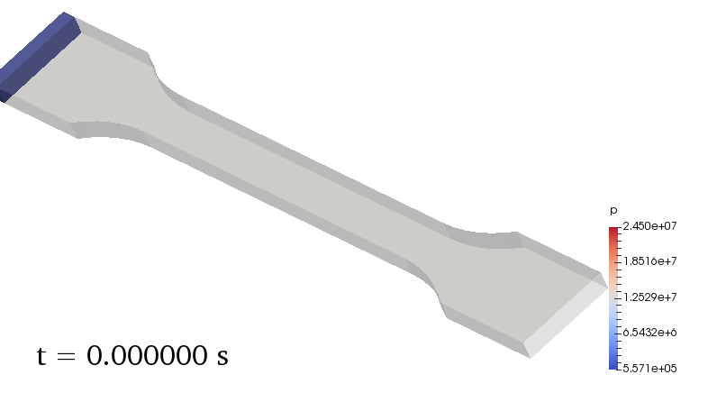

# openInjMoldSim [`v7.2`](VERSION.md)

This is an [OpenFOAM](https://en.wikipedia.org/wiki/OpenFOAM) solver for simulation of injection molding filling, packing and cooling stages.
It is a modification of the compressibleInterFoam solver distributed with OpenFOAM.
Currently, the simulation is prohibitively inconvenient for typical industrial use but it can be helpful in research because it can be customized.  

## Getting Started: [watch video](https://www.youtube.com/watch?v=aNC0CqfDyT0)

An [OpenFOAM 7 installation](https://openfoam.org/download/archive/) is required to run the code.

Run `./Allwmake` in the solver directory to compile the code.

To run the dogbone case, set the `numberOfSubdomains` in the [`decomposeParDict`](/tutorials/demo/dogbone/system/decomposeParDict) according to
your machine. Run `./AllMesh` and then `./AllRun` in the [`dogbone`](/tutorials/demo/dogbone) directory to run the example simulation. Then run `paraFoam` in the case directory to view the results.

## Functionality

* Compressible, non-isothermal, laminar cavity flow.
* Tait equation of state.
* Cross-WLF viscosity model.
* Specific heat and thermal conductivity may depend on temperature and pressure (tabular form).
* Elastic stress in the solid phase.
* Fiber orientation (openInjMoldSimF).

## Resources

- Please cite
  - [Krebelj et al. Modeling Injection Molding of High-Density Polyethylene with Crystallization in Open-Source Software](https://www.mdpi.com/2073-4360/13/1/138) - see the [fork](https://github.com/krebeljk/openInjMoldDyMSimCr).
  - [Pedro et al. - Verification and Validation of openInjMoldSim, an Open-Source Solver to Model the Filling Stage of Thermoplastic Injection Molding](https://www.researchgate.net/publication/341807768_Verification_and_Validation_of_openInjMoldSim_an_Open-Source_Solver_to_Model_the_Filling_Stage_of_Thermoplastic_Injection_Molding).
  - [Krebelj et al. - The cooling rate dependence of the specific volume in amorphous plastic injection molding](https://rdcu.be/but3t) - see the [fork](https://github.com/krebeljk/openInjMoldDyMSimAmClr) of this code.
- See also
  - [Youtube presentation: Verification and assessment of an open source solver for the filling stage of the injection moulding process](https://www.youtube.com/watch?v=IFEQwgOA7l8).
  - [Numerical tests](https://nbviewer.jupyter.org/github/krebeljk/openInjMoldSim/blob/master/tutorials/Tutorials.ipynb).
  - For general info about OpenFOAM see the unofficial wiki [openfoamwiki.net](https://openfoamwiki.net/index.php/Main_Page), the community forum [cfd-online.com](https://www.cfd-online.com/Forums/openfoam/) or [wiki.openfoam.com](https://wiki.openfoam.com/Main_Page) (note the `.com`, this solver needs `.org`).

## Acknowledgments

The work was supported by
- [Laboratory for Numerical Modelling and Simulation - LNMS](http://lab.fs.uni-lj.si/lnms/)
- [Computational Rheology @ Institute for Polymers and Composites (projects MOLDPRO|POCI-01-0145-FEDER-016665  and  FAMEST|POCI-01-0247-FEDER-024529)](https://crheo.org/)

Special thanks to
* **Janez Turk** - Provided the initial modifications to the original OpenFOAM library.
* **Kerstin Heinen** - [Publicly shared](https://www.cfd-online.com/Forums/openfoam-solving/58034-fiber-suspension-solver-laminar-advanifolgartucker-model.html) the OpenFOAM implementation of the AdvaniFolgarTucker which was included in this solver.

## License

This project is licensed under the GPL License - see the [LICENSE.md](LICENSE.md) file for details.

## Disclaimer
This solver is built for OpenFOAM but is not part of OpenFOAM [openfoam.org](https://openfoam.org/). 

## Contact

krebeljk()gmail.com
