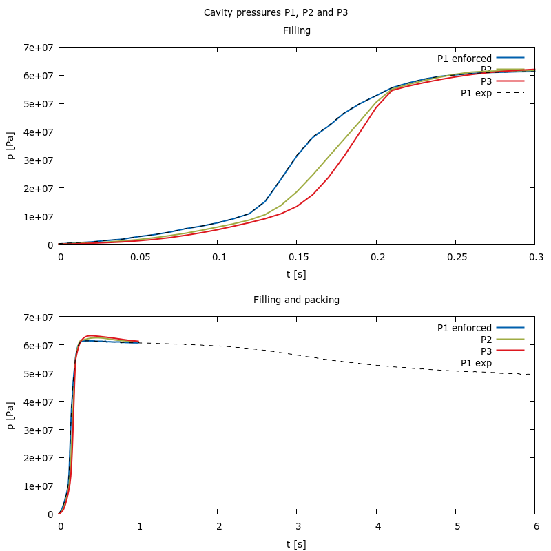
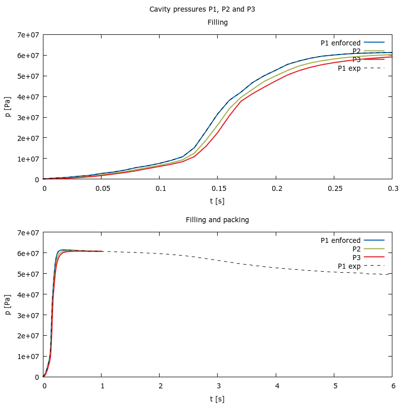

# Resolve
Modifications of the demo/fill\_pack case intended to gain insight into the spurious pressure issue.

## Cases 

### pack\_01: Remove the fill stage
The demo case is copied and the run of the filling stage is removed by modifying the AllRun script. The call to
setFields is also removed to start with a filled cavity.

### pack\_02: Remove the pressure dependence of the viscosity
The parameter D3 of the Cross-WLF model is set to D3=0. This makes the viscosity independent of the pressure.

### pack\_03: Remove the heat transfer
The mold temperature is set to 230 degC which is equal to the melt temperature making heat transfer insignificant.

### pack\_04: Introduce the pressure dependence of the viscosity
Parameter D3 is again set to D3 = 0.51 K/MPa. This makes the spurious pressure behavior more evident.

### pack\_05: Set fixed time step = 1e-5s -> resonable result
A fixed timestep of 1e-5s is prescribed. One second of simulated time required almost 3h of calculation on a laptop. The
result appears resonalbe. 

### pack\_06 (from pack\_05): Adjustable time step again for reference
Expected result.

### pack\_07 (from pack\_06): Pimple p\_rgh tol 1e-4 Pa
The PIMPLE p\_rgh tolerance set to 1e-4 Pa. Solution improved.  

### pack\_08 (from pack\_06): Pimple p\_rgh tol 1e-5 Pa
The PIMPLE p\_rgh tolerance set to 1e-5 Pa. Solution improved. Calculation takes 30 min on a regular laptop.

